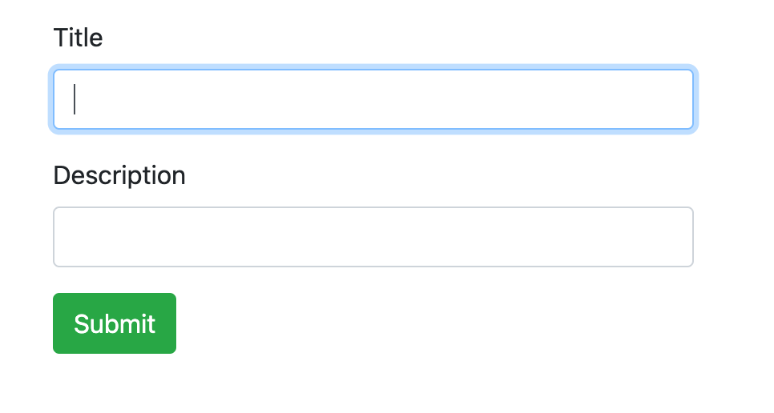
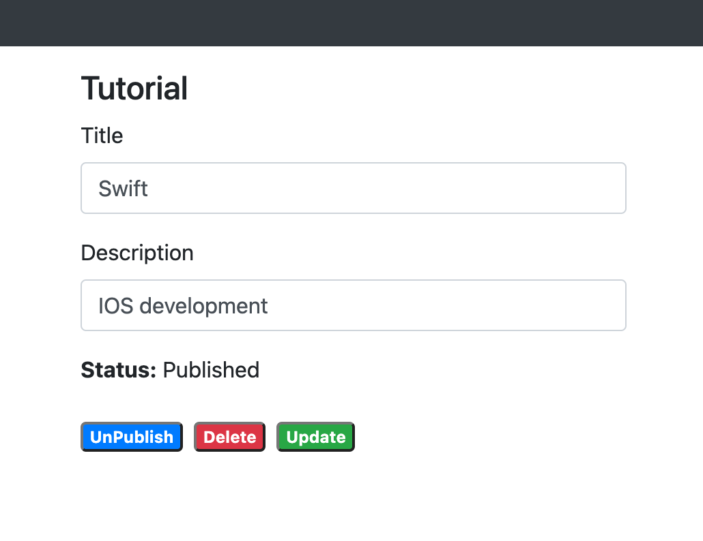
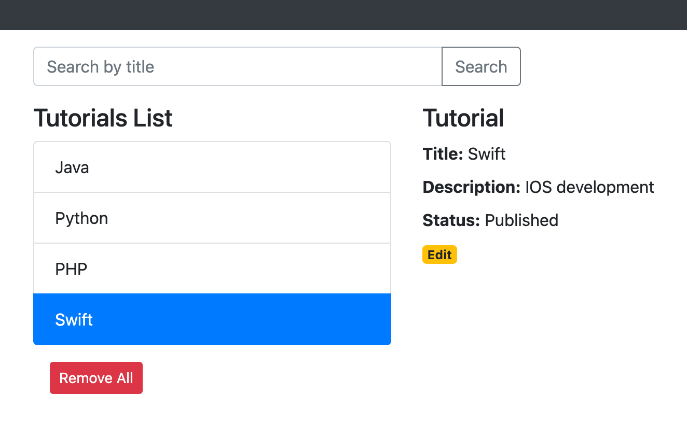

# MEAN stack application with Angular 15 CRUD

In this project, I built a full-stack (MEAN stack) Angular 15 + Node.js with a CRUD Application. The back-end server uses Node.js + Express for REST APIs and connects with MongoDB database, front-end side is an Angular App with HTTPClient.

The full-stack Tutorial Management Application in that:
- Tutorial has id, title, description, published status.
- User can create, retrieve, update, delete Tutorials.
- There is a search box for finding Tutorials by title.





## Project setup

### Node.js Server
```
cd node-js-server
npm install
```
Run `node server.js`

### Angular Client
```
cd angular-15-client
npm install
```
Run `ng serve --port 8081`. Navigate to `http://localhost:8081/`.